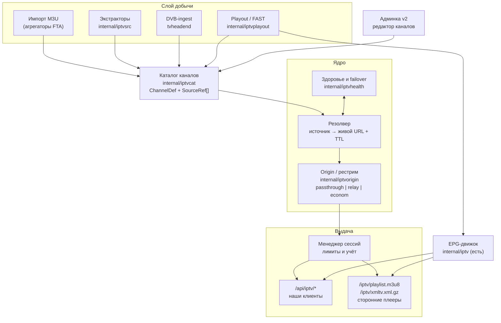

# Собственная IPTV-платформа: архитектура, изменения, стоимость

Дата: 2026-07-29. Статус: проект, не реализовано.

## Итог одним абзацем

Сегодня IPTV в lampac-go — это **клиент чужого M3U**: скачали ссылку, распарсили, отдали
клиенту URL апстрима. Чтобы перестать зависеть от платных сервисов, надо достроить пять
слоёв, которых нет: **каталог** каналов с несколькими источниками на канал, **резолверы**
(экстракторы) для добычи свежих ссылок, **origin** (один pull → N зрителей),
**здоровье с автопереключением** и **публикацию** собственного плейлиста с лимитом сессий.
Плюс два опциональных блока: **playout** для собственных FAST-каналов и **DVB-ingest**
для приёма эфира. Полный объём — примерно 30–40 дней разработки и порядка
6–8 тысяч строк нового кода; MVP (первые четыре слоя) — 15–20 дней. Главная постоянная
статья расходов не деньги, а **сопровождение экстракторов**: каждый источник ломается
несколько раз в год, и это работа навсегда.

---

## 1. Где мы сейчас (as-is)

Факты по текущему коду, от которых считаем:

| Что | Где | Состояние |
|---|---|---|
| Источник каналов | `cfg.IPTV.GlobalPlaylists` | Один внешний M3U (`m3u.su/rusm`, 266 каналов) |
| Модель канала | `internal/iptv/models.go` | **Один** `URL` на канал, зеркал нет |
| Категории | `group-title` / `#EXTGRP` | У текущего плейлиста отсутствуют → всё в «Ungrouped» |
| Качество | `detectQuality` | Угадывается по подстроке в названии, поток не пробируется |
| Правки каталога | — | Невозможны: `refresh` затирает распарсенный кэш |
| Доставка потока | `iptvResolveStreamURL` | Каждый зритель тянет апстрим сам (сырой URL или `/proxy/{enc}`) |
| Общая сессия | `iptv_econom.go`, `econSess` | Есть, но только для `?econom=1` и только с ре-энкодом |
| Здоровье | `merge.go`, `StartHealthCheck` | Раз в 30 мин, `Range: bytes=0-1`, только global-плейлисты, влияет **только** на merged-список |
| Лимит соединений | — | **Отсутствует**; `/proxy`-токены выпускаются с `verifyip=false` |
| Экспорт наружу | — | Нет ни M3U, ни XMLTV (образец есть в `wink_handler.go`) |
| Хранение | `database/iptv/*.json` | JSON, **запись не атомарная** (`os.WriteFile` без temp+rename) |
| Админка | legacy-панель | Только 6 полей конфига, редактора каналов нет |

Что уже хорошо и переиспользуется без изменений: потоковый XMLTV-парсер с жёсткими
лимитами памяти и EPG-движок; `proxylink` + `proxyapi` (шифрованные ссылки, наследование
заголовков в суб-URL, переписывание m3u8/mpd, ретраи); `trimLiveDVR` и 2-секундный TTL
live-манифеста; планировщик транскодинга с семафором, disk-budget и memory-gate;
подписанный offload на remote box; `httpclient` с uTLS/SOCKS5/VLESS.

---

## 2. Целевая архитектура



### 2.1 Каталог — `internal/iptvcat` (новый пакет)

Центральное изменение: **канал перестаёт быть строкой из чужого M3U и становится нашей
записью со списком источников**.

```go
type ChannelDef struct {
    ID       string   // стабильный slug: "perviy", "match-tv" — не md5(url)
    Title    string
    Logo     string
    Category string   // наша категория, не group-title
    TvgID    string   // для матчинга EPG
    Country  string
    Lang     string
    Number   int
    Adult    bool
    Enabled  bool
    Anchor   bool     // always-on в origin
    Sources  []SourceRef
    Origin   OriginMode // passthrough | relay | econom
}

type SourceRef struct {
    Kind     string // "url" | "extractor" | "dvb" | "fast"
    Value    string // URL, имя экстрактора+параметры, mux-id, id расписания
    Priority int    // меньше = предпочтительнее
    Headers  map[string]string
    Proxy    string // метка egress-прокси для ЭТОГО источника
    Health   SourceHealth // runtime, не сериализуется
}
```

Ключевые решения:

**Стабильный ID.** Сейчас `channelID = md5(url+"|"+name)[:8]` — при смене URL канал
теряет избранное, историю и позицию в EPG. Новый ID — рукописный slug, живущий вечно.
Миграция: старый ID остаётся в `LegacyIDs []string`, чтобы клиенты не потеряли избранное.

**Импорт как наполнитель, а не как каталог.** Чужой M3U больше не «есть» каталог — он
источник кандидатов. Импорт матчит канал по `tvg-id`/нормализованному имени и **добавляет
SourceRef** к существующей записи, а не создаёт новую. Ручные правки живут в отдельном
слое `overrides.json` (ключ — `ChannelDef.ID`), и никакой `refresh` их не трогает.

**Хранение — JSON, без БД.** Проект целиком на JSON-файлах (около 40 сторов в
`database/`), SQLite не используется нигде. Каталог на 2000 каналов — это ~2–4 МБ JSON,
держится в памяти с индексами, пишется батчем по тикеру (модель `tgauth.Store`
с `backgroundSaver`). Вводить SQLite ради одной подсистемы — лишняя зависимость и
чужеродный для репозитория паттерн.

**Атомарная запись — обязательна.** Текущий `iptv/store.go` пишет через `os.WriteFile`;
обрыв процесса даёт битый JSON, и на старте канал просто исчезает. В проекте уже пять
независимых копий `writeAtomic` — берём одну (например `tgauth/store.go:258`) и выносим
в общий хелпер, раз всё равно трогаем.

### 2.2 Резолверы — `internal/iptvsrc` (новый пакет)

Экстрактор достаёт свежую ссылку с сайта вещателя (обычно с токеном на TTL).
Паттерн один в один с балансерами (`internal/litesrc`), но **без их системы регистрации**:

```go
type Extractor interface {
    Name() string
    Resolve(ctx context.Context, params string) (StreamRef, error)
}

type StreamRef struct {
    URL     string
    Headers map[string]string
    TTL     time.Duration
    Proxy   string
}
```

Почему свой реестр, а не `litesrc`: новый балансер сейчас требует записи **в пять
разных мест** (`lite_sources.go` конструкторы + карта роутов, `localCorePlugins`,
`pluginQualityBadge`, `config.OnlineConfig`, `knownBalancers` в админке), и пропуск любого
даёт молчаливую поломку — kinobadi, например, работает, но в админ-панели его нет.
Экстрактору каналов не нужны ни HTML для Lampa, ни `checksearch`, ни бейджи качества.
Один `map[string]Extractor` с регистрацией в `init()` и одной строкой в каталоге.

Что берём из существующего бесплатно: `httpclient.NewForBalancer` / `NewUTLSForBalancer`
(uTLS Chrome-fingerprint, SOCKS5/VLESS по метке), `balancerDoWithRetry` (ретраи 502/503/504
и сетевых ошибок с задержками 200мс/500мс/1с), кэш с TTL под `sync.RWMutex`.

Объём: 150–350 строк на экстрактор — ровно как простой балансер (`kinobadi.go` — 347,
`plvideo.go` — 150).

### 2.3 Origin / рестрим — `internal/iptvorigin` (новый пакет)

Самое важное изменение по существу. Три режима на канал:

| Режим | Что делает | CPU на канал | Когда |
|---|---|---|---|
| `passthrough` | Как сейчас: каждый зритель тянет апстрим (сырой URL или `/proxy`) | 0 | Слабые/редкие каналы, экономия трафика |
| `relay` | **Один pull → N зрителей**, ремукс `-c copy` в HLS | 2–5% ядра | По умолчанию для своих каналов |
| `econom` | Полный ре-энкод с даунскейлом | 0.8–1.5 ядра | Тонкий канал у клиента, lite-устройства |

`relay` — это то, чего сейчас нет, и оно решает сразу три задачи: источник видит ровно
одно соединение с одного IP (нас не банят за «шаринг»), нагрузка на апстрим не растёт
с числом зрителей, и мы получаем точку контроля для метрик и failover.

Реализация: расширить `transcodesvc` режимом `relay` (тот же HLS-выход, но `-c copy`
вместо энкодера) — вся обвязка уже есть: планировщик слотов с 503/`Retry-After`,
`disk_budget_mb` с вытеснением, `idle_timeout_sec_live`, реконнект ffmpeg
(`-reconnect_on_network_error`), барьер завершённости сегмента, `trimLiveDVR`.

Менеджер сессий поглощает нынешний `econSess` из `iptv_econom.go` и обобщает его:
ключ — `ChannelDef.ID` (а не сырой URL), одна сессия на канал в любом режиме, старт по
первому зрителю, стоп по idle, `Anchor`-каналы держатся всегда.

**Придётся включить auto-restart для live.** Сейчас он намеренно выключен
(`transcoding_service.go:2639`): live-джоба при падении просто чистится, а «Эконом»
поднимает новую по следующему запросу. Для рестрима, где поток терять нельзя, нужна своя
политика: рестарт с бюджетом попыток, а после исчерпания — переход на следующий
`SourceRef`.

### 2.4 Здоровье и failover — `internal/iptvhealth` (новый пакет)

Текущий health-check заменяется полностью. Модель берём из `torrbalancer.Pool` — самая
проработанная в репозитории и уже обкатанная в проде:

- **Пассивные страйки.** Ошибка приходит не от тикера, а по факту: `/proxy` получил 5xx
  или пустое тело, ffmpeg в origin не открыл вход, экстрактор вернул ошибку. Страйки
  дедуплицируются по `ChannelDef.ID` (в `torrbalancer` — по infohash), чтобы один
  ретраящийся канал не осудил здоровый источник.
- **Карантин с half-open.** N различных отказов в скользящем окне → источник в карантин
  на фиксированное время; по истечении он снова участвует и при сохранившейся проблеме
  перетрипается за секунды. Это даёт реакцию за секунды вместо нынешних 30 минут.
- **Активный пробер — с настоящей валидацией.** Не `Range: bytes=0-1` (он говорит только
  «сервер отвечает»), а забрать манифест, скачать сегмент, прогнать `ffprobe`. Это заодно
  заполняет реальные `width/height/bitrate/audio` и убивает угадывание качества по
  названию канала.
- **Выбор источника** — по `Priority` среди живых. HRW-хеширование (как в
  `torrbalancer.PickForHash`) нужно только если источников на канал станет много и
  захочется размазывать нагрузку; для 2–3 зеркал достаточно приоритета.

Отдельно: есть **готовый костыль на сегодня** — `choosePrimaryURL` в
`proxyapi/handler.go:1551` уже понимает строку `"urlA or urlB"` и пробует первый с
таймаутом 7 с. Это буквально failover на два URL без единой строки нового кода; годится,
чтобы закрыть дыру до готовности `iptvhealth`.

### 2.5 Публикация и доступ — `internal/iptvpub`

Два новых роута, чтобы это был сервис, а не только фича нашего клиента:

- `GET /iptv/playlist.m3u8?token=…` — собственный M3U. Образец готов:
  `wink_handler.go:45` + `buildM3U` в `wink_tv.go:158` (пишет `#EXTM3U`,
  `#EXTINF:-1 tvg-id tvg-name tvg-logo group-title`, Content-Type
  `application/vnd.apple.mpegurl`).
- `GET /iptv/xmltv.xml.gz?token=…` — собственный EPG для TiviMate/Kodi/VLC.

**Лимит сессий — не опция, а обязательная часть.** Сейчас лимитов нет вообще, а
`/proxy`-токены для IPTV выпускаются с `verifyip=false`, то есть ссылка переиспользуема
кем угодно и откуда угодно. Нужны: счётчик одновременных потоков на пользователя (лимит
из `UserGroup` — механизм групп уже есть, `tgauth/groups.go`), учёт по (token, IP, UA),
вытеснение самой старой сессии при превышении. Без этого собственный плейлист расшарят
в первую же неделю.

### 2.6 EPG

Здесь почти всё готово: потоковый XMLTV-парсер с лимитами памяти (`epgMaxTitleBytes`,
`epgMaxProgramsPerChannel` и т.д. — они появились после инцидента на 410–709 МБ строк),
движок с окном −1/+2 дня, бинарный поиск по программам, self-heal при несовпадении id.

Что доделать:
- Матчинг `tvg-id` перевести с self-heal-костыля на явную таблицу в каталоге
  (`ChannelDef.TvgID` заполняется при импорте и правится в админке).
- Для FAST-каналов — генерация XMLTV прямо из расписания playout.
- Издатель `/iptv/xmltv.xml.gz`.

### 2.7 Playout / FAST-каналы — `internal/iptvplayout` (опционально, фаза 6)

Линейное вещание из собственной VOD-библиотеки: расписание → ffmpeg concat → HLS →
тот же origin. Технически это самый простой блок из всех (нет чужих сайтов, нечему
ломаться), а как продукт — единственное, чего заведомо нет у перепродавцов чужих
подписок. EPG для таких каналов генерируется автоматически и всегда точен.

### 2.8 DVB-ingest (опционально, фаза 7)

Свой стек DVB **не пишем** — ставим tvheadend, он даёт HTTP-выход, и интегрируем его как
`SourceRef{Kind: "dvb"}`. Наш код — только адаптер к его API, ~300–400 строк.

### 2.9 Админка

Новая страница v2 `web/admin/pages/iptv-channels.js` плюс отдельное admin-API. Образец —
`pages/torrbalancer.js` (436 строк): `state` + `load()` + `act(action, payload)`
единым POST + `paint()` + `renderEditor()`. Компоненты (`l-table`, `l-modal`, `l-input`,
`l-toast`) готовы, билд-шага нет вообще — plain ES-модули с `//go:embed`, Lit вендорится
локально.

Что должно быть в редакторе: список каналов с фильтрами и статусом здоровья; карточка
канала с источниками (добавить/удалить/переставить приоритет/назначить egress-прокси);
режим origin; ручные override метаданных; массовые операции после импорта; кнопка «проба
источника» с выводом реального `ffprobe`.

---

## 3. Что меняется в существующем коде

Точки изменения, по которым считается объём:

| Файл | Изменение | Масштаб |
|---|---|---|
| `internal/iptv/store.go` | Переезд с `PlaylistCache` на каталог; **атомарная запись** | Крупное |
| `internal/iptv/merge.go` | `StartHealthCheck`/`probeAlive` → `iptvhealth`; merge остаётся только как объединение | Крупное |
| `internal/iptv/m3u_parser.go` | Импорт в каталог вместо кэша; фикс `cleanChannelName` («360° (1080p)» → «°») | Среднее |
| `internal/iptv/models.go` | `Channel` → `ChannelDef` + `SourceRef` | Крупное |
| `internal/iptvhttp/iptv_api.go` | DTO: источников теперь много; сохранить утечко-защиту (`toPublicChannel`) | Среднее |
| `internal/iptvhttp/iptv_proxy.go` | `iptvResolveStreamURL` → вызов резолвера + origin | Крупное |
| `internal/iptvhttp/iptv_econom.go` | `econSess` поглощается менеджером сессий | Среднее |
| `internal/transcodesvc/transcoding_service.go` | Режим `relay` (`-c copy`); включить auto-restart для live (:2639) | Среднее |
| `internal/proxyapi/handler.go` | Страйки в `iptvhealth`; per-channel egress вместо жёсткого `plugin="iptv"` | Среднее |
| `internal/proxylink/manager.go` | Метка прокси в payload (или plugin вида `iptv:<label>`) | Малое |
| `internal/config/config.go` | Расширение `IPTVConfig` | Малое |
| `internal/adminhttp/admin_panel_plugins.go` | Секция `[iptv]` → отдельное admin-API | Среднее |
| `web/admin/app.js` + новая страница | Редактор каналов | Крупное |

**Клиенты — четыре штуки, все придётся трогать** (категории из каталога вместо
`group-title`, статус здоровья, выбор режима origin, реальное качество):

- `ubuntu/plugins/iptv2.js` — 1157 строк, 11 вызовов API
- `ddd-client/web`: `lib/api/iptv.ts` (359), `screens/LiveTV.svelte`, `screens/Player.svelte`
- `ddd-client/androidtv`: `Iptv.kt` (149), `IptvActivity.kt` (203)
- `ddd-client/appletv`: `LiteClients.swift` (`IptvClient`), `TVView.swift`, `EpgGuideView.swift`

Совместимость: API-контракт `/api/iptv/*` менять не обязательно — старые поля можно
сохранить, новые добавить как опциональные. Тогда клиенты обновляются постепенно, а не
одномоментно.

---

## 4. Решения: чего мы сознательно не делаем

- **Не вводим SQLite/БД.** Весь проект на JSON-сторах; каталог на 2000 каналов —
  2–4 МБ, держится в памяти. Одна чужеродная зависимость ради одной подсистемы не окупается.
- **Не регистрируем экстракторы как балансеры `litesrc`.** Пять точек регистрации и
  молчаливые поломки при пропуске одной — плохая цена за инфраструктуру, которая нам
  почти не нужна (HTML для Lampa, checksearch, бейджи).
- **Не пишем свой DVB-стек.** tvheadend решает это лучше, интегрируется по HTTP.
- **Не делаем always-on для всех каналов.** Постоянный pull 50 каналов — это 81 ТБ
  входящего трафика в месяц (расчёт ниже). Always-on только для `Anchor`.
- **Не строим свой CDN.** Пока не упрёмся в полосу одного сервера, `remote_host` для
  offload транскода уже есть и покрывает первый уровень масштабирования.

---

## 5. Стоимость

### 5.1 Разработка

Оценки в днях работы, включая тесты и отладку. Диапазон отражает неопределённость,
а не «оптимистично/пессимистично».

| Фаза | Содержание | Новый код | Дни |
|---|---|---|---|
| 1 | Каталог + импорт + override-слой + admin API + страница админки | ~1400 Go, ~800 JS | 5–7 |
| 2 | `iptvhealth`: страйки, карантин, ffprobe-пробер, выбор источника | ~700 Go | 3–4 |
| 3 | `iptvorigin`: relay-режим, менеджер сессий, лимиты, auto-restart live | ~900 Go | 5–6 |
| 4 | Публикация M3U/XMLTV + токены + учёт сессий | ~450 Go | 2 |
| **MVP (1–4)** | | **~3450 Go, ~800 JS** | **15–19** |
| 5 | Реестр экстракторов + первые 5 источников | ~300 + 5×250 Go | 5–7 |
| 6 | Playout/FAST: расписание, concat, генерация EPG, UI | ~1100 Go, ~400 JS | 6–8 |
| 7 | DVB-ingest: адаптер tvheadend | ~350 Go | 2–3 |
| 8 | Адаптация четырёх клиентов | ~600 смешанно | 3–4 |
| **Полный объём** | | **~6800 Go, ~1800 JS/Kotlin/Swift** | **31–41** |

Каждый следующий экстрактор после первых пяти — 0.5–1 день.

### 5.2 Трафик и железо

Расчёт для 1080p H.264 при 5 Мбит/с (типично для эфирного рестрима):
один час просмотра = 5 Мбит/с × 3600 с ÷ 8 = **2.25 ГБ**. Для 720p при 2.5 Мбит/с —
**1.1 ГБ/час**.

**Исходящий трафик** (сценарий: 200 активных подписчиков, 3 часа просмотра в день):

| Профиль | В день | В месяц | Пик при 20% онлайн |
|---|---|---|---|
| 1080p | 1350 ГБ | ~40 ТБ | 200 Мбит/с |
| 720p (econom) | 660 ГБ | ~20 ТБ | 100 Мбит/с |

**Входящий трафик** (pull от источников) зависит от режима:

- `passthrough` — 0 (зритель тянет сам), но нет контроля и нас видно как «шаринг».
- `relay` по запросу — платим только за каналы, которые сейчас кто-то смотрит.
- `relay` always-on — 1 канал 1080p = 5 Мбит/с × 2.592·10⁶ с/мес ÷ 8 = **1.6 ТБ/мес**.
  Отсюда: 10 якорных каналов ≈ 16 ТБ/мес, а 50 always-on ≈ **81 ТБ/мес** — вот почему
  always-on должен быть исключением, а не режимом по умолчанию.

Разумная цель: ~20 ТБ исходящего + ~15 ТБ входящего = **~35 ТБ/мес суммарно**.

**CPU:**

- `relay` (ремукс `-c copy`): 2–5% ядра на канал → 50 каналов ≈ 1.5–2.5 ядра.
  Масштабируется отлично.
- `econom` (x264 veryfast, 1080p→720p): 0.8–1.5 ядра на поток. **Не масштабируется**:
  8 ядер — это 5–8 одновременных транскодов. Отсюда правило: транскод только по явному
  запросу клиента, не по умолчанию.
- NVENC на одной потребительской карте: практически 10–20 потоков 1080p→720p.

**Деньги** (порядки величин на начало 2026, проверять у конкретного провайдера):

| Позиция | Оценка |
|---|---|
| VPS 4 vCPU / 8–16 ГБ с 20–30 ТБ трафика | $10–40/мес |
| Отдельная нода 1 Гбит/с unmetered (когда упрёмся в полосу) | $40–120/мес |
| Транскод-нода с GPU (`remote_host`) | $80–200/мес, либо своё железо |
| DVB-S2 тюнер (USB попроще / PCIe на 2–4 входа) | $50–100 / $200–400 единоразово |
| Тарелка + конвертер | $50–150 единоразово |

Важно про DVB: тюнеру нужен физический доступ к небу, то есть дом или офис, а не
датацентр. Значит узкое место — исходящий канал от этой точки, и рестримить оттуда на
всех подписчиков не выйдет. Правильная схема: тюнер отдаёт **один** поток на канал в
датацентр, а раздаёт уже origin.

### 5.3 Постоянная эксплуатация — главная статья

Это то, что не видно в смете, но определяет реальную стоимость:

- **Экстракторы ломаются.** Вещатель меняет схему токена, добавляет WAF, вводит
  гео-проверку. Один источник — в среднем несколько поломок в год. 50 экстракторов
  означают, что что-то сломано практически всегда. Это работа навсегда, и именно она,
  а не разработка, определяет, потянем ли мы «пополнение».
- **Алерты требуют реакции.** Мониторинг без дежурства бесполезен: канал упал в 3 ночи —
  до утра он мёртв, если failover не сработал автоматически. Отсюда приоритет фазы 2.
- **Мы становимся единственной точкой отказа.** Сейчас, если `m3u.su` умер, умер один
  плейлист и клиент видит ошибку. После перехода на origin падение нашего сервера
  означает, что IPTV нет вообще ни у кого.
- **Abuse-жалобы.** Рестрим с VPS привлекает жалобы к провайдеру; в худшем случае —
  отключение сервера без предупреждения. Нужен план Б по хостингу заранее.

### 5.4 Риски и что с ними делать

| Риск | Митигация |
|---|---|
| Источник банит наш egress-IP (один IP тянет 50 каналов) | Per-channel прокси через `SourceRef.Proxy`; инфраструктура SOCKS5/VLESS готова, нужна лишь передача метки в `proxylink` |
| Origin — единая точка отказа | `Anchor`-каналы дублировать на remote box; `passthrough` как аварийный откат при недоступности origin |
| Транскод съедает CPU и роняет весь сервер | Уже есть: отдельные пулы, `min_free_mem_mb`, `disk_budget_mb`, 503 вместо очереди. Держать `econom` строго opt-in |
| Каталог битый после обрыва записи | Атомарная запись + бэкап-ротация (для конфига механизм уже есть, `createBackup`) |
| Расшаривание собственного плейлиста | Лимит сессий из фазы 3 — блокирующее требование, не «потом» |
| Правовая экспозиция | FTA-эфир, официальные открытые потоки вещателей и собственный контент безопасны; ретрансляция платных пакетов остаётся ретрансляцией платных пакетов, чья бы инфраструктура её ни несла |

---

## 6. Порядок работ

Фазы упорядочены так, чтобы каждая давала пользу немедленно, даже если следующая
не начнётся.

**Фаза 1 — каталог.** Готово, когда: канал имеет несколько источников; ручная правка
названия/логотипа/категории переживает `refresh`; импорт чужого M3U добавляет источники
к существующим каналам, а не плодит дубликаты; в админке есть редактор.
*Польза сразу:* исчезает «Ungrouped» на 266 каналов, появляется возможность вообще
что-либо пополнять.

**Фаза 2 — здоровье и failover.** Готово, когда: ошибка потока приводит к переключению
на зеркало за секунды, а не за 30 минут; в админке видно, какой источник живой и почему
упал предыдущий; качество берётся из `ffprobe`, а не из названия.
*Польза сразу:* работает и на нынешних чужих плейлистах, до всякого рестрима.

**Фаза 3 — origin + лимиты.** Эти две вещи приезжают одной пачкой: рестрим без учёта
сессий — это подарок тем, кто расшарит ссылку. Готово, когда: 10 зрителей одного канала
дают одно соединение к источнику; лимит одновременных потоков берётся из группы
пользователя; падение ffmpeg не убивает канал.

**Фаза 4 — публикация.** Готово, когда: наш плейлист открывается в TiviMate и VLC
по токену, EPG подтягивается, лимит сессий работает и там.

**Дальше по потребности:** экстракторы (фаза 5) — если хотим независимости от
агрегаторов; FAST-каналы (фаза 6) — если хотим то, чего нет у конкурентов;
DVB (фаза 7) — если хотим потоки, которые физически нельзя отключить.

Клиенты (фаза 8) размазываются по фазам: контракт `/api/iptv/*` расширяется
обратносовместимо, поэтому старые сборки продолжают работать всё время перехода.
